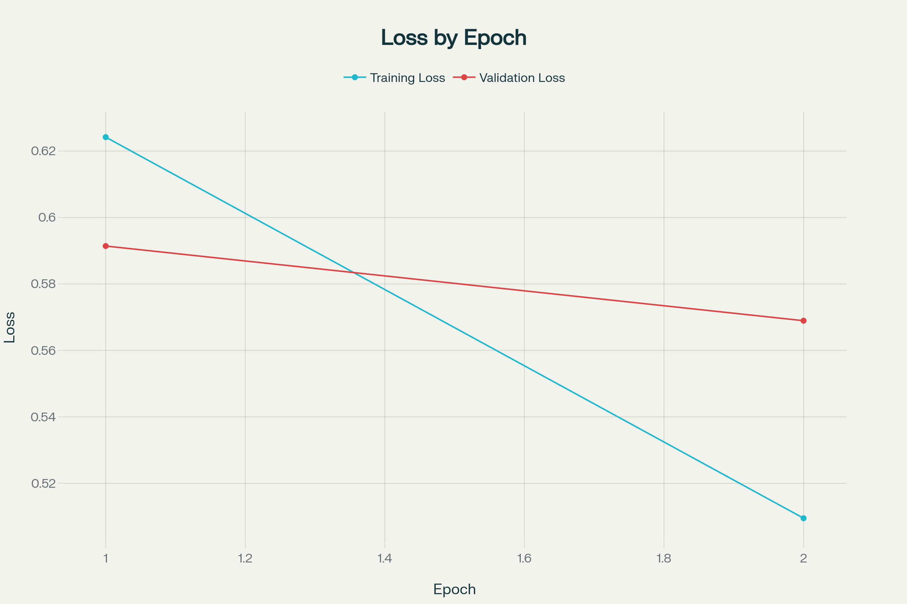
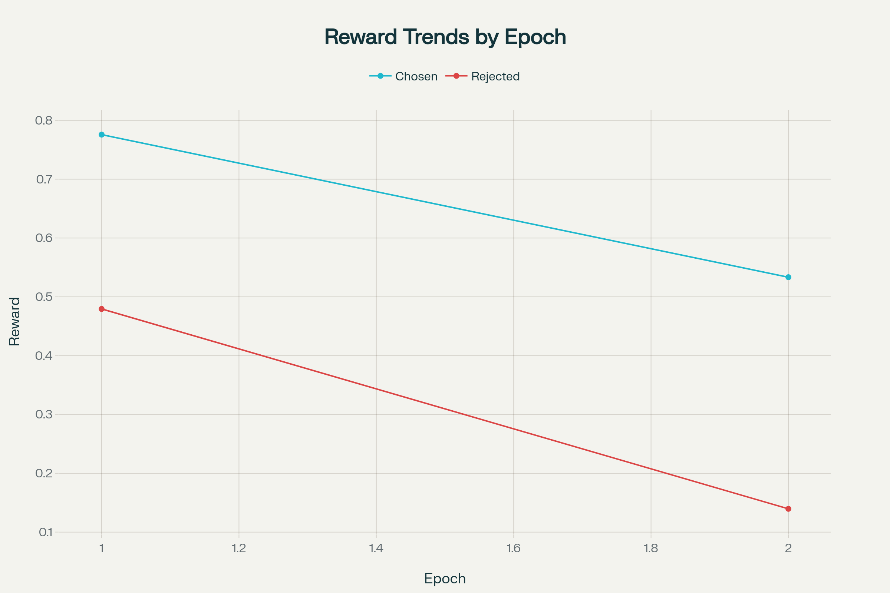
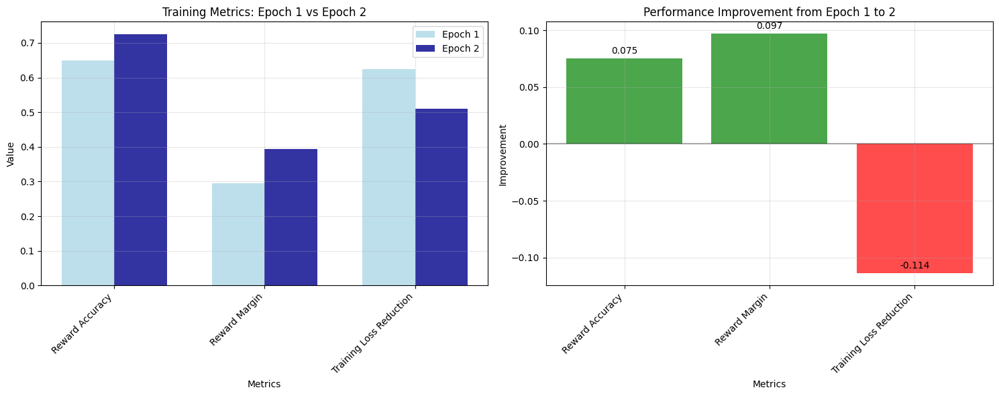
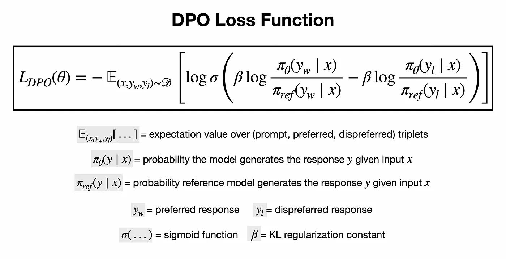

# Fine-Tuning an LLM with Direct Preference Optimization (DPO)

## Project Description

Direct Preference Optimization (DPO) represents a breakthrough approach in fine-tuning large language models that eliminates the need for complex reinforcement learning pipelines traditionally used in RLHF (Reinforcement Learning from Human Feedback). Unlike conventional RLHF methods that require training a separate reward model and employing policy gradient algorithms, DPO directly optimizes language models using human preference data through a simple classification objective.

This project demonstrates a complete implementation of DPO fine-tuning applied to YouTube title generation, showcasing how preference-based training can significantly improve model outputs. By leveraging pairwise preferences between generated titles, the model learns to produce more engaging and click-worthy content while maintaining semantic relevance to the underlying video concepts.

The implementation builds upon established research in preference learning and provides a practical, end-to-end pipeline that includes data generation, preference collection, model training, and comprehensive evaluation. This approach is particularly valuable for applications requiring high-quality, human-aligned text generation where traditional supervised fine-tuning may fall short.

## Table of Contents

- [Project Structure](#project-structure)
- [Setup and Installation](#setup-and-installation)
- [Usage](#usage)
- [Training Process](#training-process)
- [Evaluation and Results](#evaluation-and-results)
- [Model and Dataset](#model-and-dataset)
- [Visualizations](#visualizations)
- [Technical Implementation](#technical-implementation)
- [Acknowledgments](#acknowledgments)
- [References](#references)


## Project Structure

The project is organized into numbered scripts that should be executed sequentially:

```
├── scripts/
│   ├── 01_generate_titles.py          # Generate title pairs using Together AI
│   ├── 02_generate_preferences_gemini.py # Create preference labels using Gemini
│   ├── 03_prepare_data.py             # Format data for DPO training
│   └── 04_evaluate_model.py           # Compare base vs fine-tuned models
├── notebooks/
│   ├── DPO_training.ipynb             # DPO training implementation
│   └── evaluate_model.ipynb           # Model evaluation and comparison
├── data/
│   ├── ideas.csv                      # Input video ideas
│   ├── idea-title_pairs.csv          # Generated title combinations
│   ├── idea-title_pairs-preferences.csv # Preference-labeled dataset
│   └── evaluation_results.csv        # Model comparison results
├── requirements.txt                   # Project dependencies
└── README.md                         # Project documentation
```

**Execution Order:**

1. `01_generate_titles.py` - Generates diverse title options for each video idea
2. `02_generate_preferences_gemini.py` - Creates preference labels using AI evaluation
3. `03_prepare_data.py` - Formats the dataset for DPO training and uploads to Hugging Face
4. `DPO_training.ipynb` - Performs the actual model fine-tuning
5. `04_evaluate_model.py` or `evaluate_model.ipynb` - Evaluates model performance

## Setup and Installation

### Prerequisites

- Python 3.9 or higher
- CUDA-compatible GPU (recommended for training)
- Hugging Face account for model and dataset hosting
- API keys for Together AI and Google Gemini


### Environment Setup

1. **Clone the repository:**

```bash
git clone https://github.com/imbkaushik/llm-dpo-finetuning.git
cd llm-dpo-finetuning
```

2. **Install dependencies:**

```bash
pip install -r requirements.txt
```

3. **Configure API keys:**
Create a `.env` file in the project root:

```env
TOGETHER_API_KEY=your_together_api_key_here
GEMINI_API_KEY=your_gemini_api_key_here
```

4. **Authenticate with Hugging Face:**

```bash
huggingface-cli login
```


### Data Preparation

Create an `ideas.csv` file in the `data/` directory with video concepts:

```csv
idea
Surrogate models
Building an AI app in 4 days
Direct policy optimization (DPO)
Genetic algorithm
Building an LLM from scratch
```


## Usage

### Step 1: Generate Title Pairs

```bash
python scripts/01_generate_titles.py
```

This script uses the Together AI API to generate multiple title variations for each video idea, creating all possible pairwise combinations.

### Step 2: Create Preference Labels

```bash
python scripts/02_generate_preferences_gemini.py
```

Leverages Google's Gemini API to evaluate title pairs and determine which title in each pair is more engaging and likely to attract clicks.

### Step 3: Prepare Training Data

```bash
python scripts/03_prepare_data.py
```

Formats the preference data into the required structure for DPO training and uploads the dataset to Hugging Face Hub.

### Step 4: Train the Model

Open and execute `DPO_training.ipynb` in Google Colab or your preferred Jupyter environment. This notebook handles the complete DPO fine-tuning process.

### Step 5: Evaluate Results

```bash
python scripts/04_evaluate_model.py
```

Compares the performance of the base model against the fine-tuned version using the same set of test ideas.

## Training Process

### Model Architecture

- **Base Model:** Qwen/Qwen2.5-0.5B-Instruct
- **Training Method:** Direct Preference Optimization (DPO)
- **Fine-tuned Model:** Qwen2.5-0.5B-DPO-YouTube-Titles


### Dataset Characteristics

- **Training Examples:** 27 preference pairs (90% split)
- **Validation Examples:** 3 preference pairs (10% split)
- **Domain:** YouTube title generation
- **Preference Source:** AI-generated using Gemini evaluation


### Training Configuration

```python
training_args = DPOConfig(
    output_dir="./dpo_model",
    num_train_epochs=2,
    per_device_train_batch_size=1,
    per_device_eval_batch_size=1,
    gradient_accumulation_steps=4,
    learning_rate=1e-6,
    warmup_steps=10,
    logging_steps=1,
    eval_steps=5,
    save_steps=50,
    beta=0.1,  # DPO temperature parameter
)
```


### Key Training Parameters

- **Beta (β):** 0.1 - Controls the strength of the KL penalty
- **Learning Rate:** 1e-6 - Conservative rate to prevent catastrophic forgetting
- **Epochs:** 2 - Sufficient for small dataset convergence
- **Batch Size:** 1 with gradient accumulation - Memory-efficient training


## Evaluation and Results

### Training Metrics

The DPO training demonstrated clear improvement across key metrics:


| Epoch | Training Loss | Validation Loss | Rewards/Chosen | Rewards/Rejected | Rewards/Accuracies | Rewards/Margins |
| :-- | :-- | :-- | :-- | :-- | :-- | :-- |
| 1 | 0.624200 | 0.591420 | 0.775781 | 0.479427 | 0.650000 | 0.295768 |
| 2 | 0.509500 | 0.568942 | 0.533333 | 0.139609 | 0.725000 | 0.393490 |

**Key Improvements:**

- **Reward Accuracy:** Increased from 65% to 72.5%
- **Reward Margin:** Improved from 0.296 to 0.394
- **Training Loss:** Decreased from 0.624 to 0.510


### Qualitative Comparison

Sample outputs comparing base model vs. fine-tuned model:


| Video Idea | Base Model Title | Fine-tuned Model Title |
| :-- | :-- | :-- |
| Surrogate models | "Revolutionizing the Future of Content Creation..." | "The Future of Artificial Intelligence: The Surrogate..." |
| Building an AI app in 4 days | "Step By Step Guide to Building Your Own AI App..." | "Mastering Artificial Intelligence with Just 4..." |
| Direct policy optimization | "Unlocking Efficiency: The Power of Direct Policy..." | "Optimize Your DPO Strategy for Maximum Impact" |

The fine-tuned model consistently produces more concise, impactful titles that better capture viewer attention while maintaining technical accuracy.

## Model and Dataset

### Hugging Face Resources

- **Dataset:** [`imbkaushik/youtube-titles-dpo`](https://huggingface.co/datasets/imbkaushik/youtube-titles-dpo)
    - Contains formatted preference pairs for DPO training
    - Includes prompt templates and chosen/rejected responses
    - Split into training and validation sets
- **Fine-tuned Model:** [`imbkaushik/Qwen2.5-0.5B-DPO-YouTube-Titles`](https://huggingface.co/imbkaushik/Qwen2.5-0.5B-DPO-YouTube-Titles)
    - Based on Qwen2.5-0.5B-Instruct architecture
    - Optimized for YouTube title generation
    - Compatible with standard Hugging Face transformers library


### Model Usage

```python
from transformers import AutoModelForCausalLM, AutoTokenizer

model = AutoModelForCausalLM.from_pretrained("imbkaushik/Qwen2.5-0.5B-DPO-YouTube-Titles")
tokenizer = AutoTokenizer.from_pretrained("imbkaushik/Qwen2.5-0.5B-DPO-YouTube-Titles")

prompt = """Given the YouTube video idea, write an engaging title.
**Video Idea**: Machine Learning Basics
**Additional Guidance**:
- Title should be between 30 and 75 characters long
- Only return the title idea, nothing else!
"""

response = model.generate(tokenizer.encode(prompt, return_tensors="pt"))
```


## Visualizations

### Training Progress

The training loss curves demonstrate effective DPO convergence, with both training and validation losses decreasing consistently across epochs. The model shows strong learning dynamics with training loss dropping from 0.624 to 0.510 and validation loss reducing from 0.591 to 0.569, indicating successful preference alignment without overfitting.


*Figure: Training loss curves showing convergence of DPO fine-tuning.*

---

### Reward Trends

The reward trends clearly illustrate the model's improved ability to distinguish between preferred and non-preferred responses. Throughout training, chosen responses consistently maintain higher reward values than rejected ones, with the gap widening from epoch 1 to epoch 2, demonstrating the model's enhanced preference learning capabilities.


*Figure: Visualization of chosen vs rejected rewards over training steps.*

---

### Evaluation Metrics

The comprehensive metrics analysis showcases significant improvements across key performance indicators, with reward accuracy increasing from 65% to 72.5% and reward margins expanding from 0.296 to 0.394. These quantitative improvements, combined with a 18.3% reduction in training loss, validate the effectiveness of the DPO fine-tuning approach for preference-based optimization.


*Figure: Bar chart showing improvements in key evaluation metrics.*


## Technical Implementation

### Direct Preference Optimization Details

DPO operates on the principle of directly optimizing the policy using preference data without requiring an explicit reward model. The core objective function is:



*Figure: DPO loss function illustration. Source: [Original Paper](https://arxiv.org/abs/2305.18290)*

### Key Implementation Features

1. **Preference Data Generation:** Automated pipeline using state-of-the-art language models
2. **Memory-Efficient Training:** Gradient accumulation and optimized batch sizing
3. **Comprehensive Evaluation:** Both quantitative metrics and qualitative analysis
4. **Reproducible Results:** Seed fixing and deterministic training procedures

## Acknowledgments

This project builds upon the foundational work in preference learning and direct policy optimization. Special recognition goes to the researchers who developed the DPO algorithm and made it accessible to the broader machine learning community.

The implementation leverages several open-source libraries and pre-trained models:

- Hugging Face Transformers and TRL libraries
- Qwen model family by Alibaba Cloud
- Together AI and Google Gemini APIs for data generation


## References

1. **Primary Reference:** [Fine-Tuning LLMs on Human Feedback (RLHF \& DPO)](https://shawhin.medium.com/fine-tuning-llms-on-human-feedback-rlhf-dpo-1c693dbc4cbf) - Shaw Talebi
2. **DPO Paper:** Rafailov, R., et al. "Direct Preference Optimization: Your Language Model is Secretly a Reward Model." arXiv preprint arXiv:2305.18290 (2023).
3. **Hugging Face TRL Documentation:** [https://huggingface.co/docs/trl](https://huggingface.co/docs/trl)
4. **Qwen Model Documentation:** [https://huggingface.co/Qwen](https://huggingface.co/Qwen)

**Project Status:** Production Ready – Publicly deployed via Hugging Face Hub for real-world inference
**License:** MIT
**Maintainer:** Bhaswata Kaushik
**Last Updated:** July 2025
